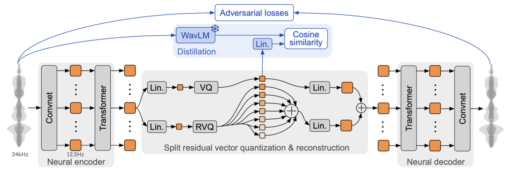

# Chinese-Mimi

<p align="center">
    
<p>

Chinese-Mimi 是一个针对中文语音优化的声码器模型，它基于 [Moshi](https://arxiv.org/abs/2410.00037) 框架中的 Mimi 组件进行改进。本仓库不仅提供了 Mimi 的完整训练和推理代码实现，还支持高效的分布式训练方案。

我们已经在超过 10,000 小时的高质量 [WenetSpeech4TTS](https://modelscope.cn/datasets/dukguo/WenetSpeech4TTS/files) 语音数据集上，训练了多个不同带宽版本的 Chinese-Mimi 模型。这些预训练模型均可直接使用，让您无需投入大量资源从零开始训练。

> Chinese-Mimi 采用渐进式训练策略，按照数据质量从 Basic、Standard 到 Premium 逐步提升模型性能。

## 前期准备

### 📚 数据准备

首先在项目根目录下创建 `/data` 文件夹，并进入该文件夹，接着创建 `WenetSpeech4TTS/Premium` 子目录，用于存放 WenetSpeech4TTS 的 Premium 数据集切片。
```bash
mkdir data; cd data
mkdir -p WenetSpeech4TTS/Premium
```
请将 WenetSpeech4TTS 的 Premium 数据集所有切片存放在 `data/WenetSpeech4TTS/Premium` 路径下。


然后在根目录下创建 `/processed_data` 文件夹，并进入该文件夹，再创建 `WenetSpeech4TTS/Premium` 子目录，此目录用于存放 Chinese-HuBERT 抽取的语义表征。
```bash
mkdir processed_data; cd processed_data
mkdir -p WenetSpeech4TTS/Premium
```

### 🤖 模型准备
在项目根目录下创建 `/models` 文件夹，用于存放预训练模型。
```bash
mkdir models
```
从 [中文 HuBERT](https://huggingface.co/TencentGameMate/chinese-hubert-large) 下载预训练好的模型，并将其存放至 `/models` 文件夹内。

### 💿 环境配置
#### 安装 ffmpeg
ffmpeg 是项目所需的重要工具，请参考 [📄知识库](https://ku.baidu-int.com/knowledge/HFVrC7hq1Q/pKzJfZczuc/2iXLjWn6TW/b2FxYEuVtzjJPi) 进行安装。

#### 安装 Python 依赖库
安装 flash attention 2 以及其他所需的依赖库，为保证下载速度，使用清华大学镜像源。
```bash
# 创建虚拟环境
conda create -n mimi python=3.10
conda activate mimi

# 降级 pip 到旧版本
python -m pip install "pip<24.1"

# 安装指定版本的 omegaconf
pip install "omegaconf>=2.0.5,<2.1"

# 安装指定版本的 hydra-core
pip install "hydra-core>=1.0.7,<1.1"

# 安装 flash attention 2
pip install flash-attn==2.3.3 --no-build-isolation --index-url https://pypi.tuna.tsinghua.edu.cn/simple
# 安装其他依赖库
pip install -r requirements.txt
```

## Mimi 训练流程

### 准备音频元文件
在项目根目录下执行以下命令，完成音频元文件的准备工作。
```bash
python -m src.data.prepare_audiodata
```

### 利用预训练的 HuBERT 抽取语义特征
抽取语义特征的脚本位于 `src/data/extract_semantic_rep.py`。在运行脚本前，请确保已经准备好原始数据和预训练的 HuBERT 模型，并修改脚本中对应的路径。
在根目录下分别执行以下命令，对训练集和验证集进行语义特征抽取。
```bash
python -m src.data.extract_semantic_rep --meta_path data/wenetspeech4tts_premium_train.jsonl
python -m src.data.extract_semantic_rep --meta_path data/wenetspeech4tts_premium_valid.jsonl
```

### 模型训练
训练配置文件为 `configs/mimi.yaml`。为了获得更好的训练效果，建议先执行 `src/utils/len_count.py` 统计训练集中音频时长（duration）的分布，并根据分布结果设置 `mimi.yaml` 中的 `segment_duration` 参数。同时，请务必将 `batch_size` 设置为偶数。
若要开启编译加速，可以将 `src/utils/compile.py` 中的参数 `_compile_disabled` 设置为 `False`。
- **分布式训练**：执行 `sh src/train.sh` 采用 DDP 分布式训练。
- **单卡训练**：执行 `python -m src.main` 采用单卡训练。

训练输出结果会保存到 `outputs` 路径，其中 `logs` 文件夹记录训练日志，`save` 文件夹保存训练好的模型。

### 效果测试
首先，创建测试集以及临时目录，用于保存重构音频。
```bash
mkdir tmp
mkdir data/WenetSpeech4TTS/test
```
请从验证集中随机选取一些测试样例，将其放入 `/test` 文件夹中。
执行以下测试脚本，对模型在验证集上的效果进行测试。
```bash
python -m src.utils.inference --epoch 20 --model-id 20241211_202021
```

#### Gradio 服务
运行以下命令启动 Gradio 服务，该服务支持使用麦克风录制音频，也可以上传音频文件进行测试。
```bash
python -m src.gradio
```